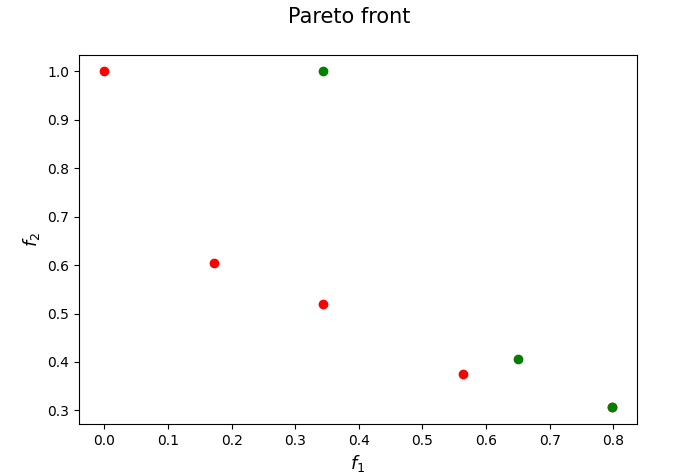
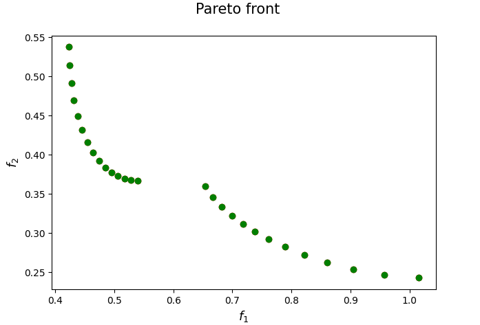

[](https://www.python.org/downloads/release/python-3110/)
[](https://opensource.org/licenses/Apache-2.0)

<p>
  
   
</p>

## Nonmonotone Front Descent Method for Multi-Objective Optimization

Implementation of the FPD_NMT framework proposed in 

[Mansueto, P., A Nonmonotone Front Descent Method
for Bound-Constrained Multi-Objective Optimization. arXiv pre-print (2025)](https://arxiv.org/abs/2509.02409)

If you have used our code for research purposes, please cite the publication mentioned above.
For the sake of simplicity, we provide the Bibtex format:

```
@misc{mansueto2025nonmonotonedescentmethodboundconstrained,
      title={A Nonmonotone Front Descent Method for Bound-Constrained Multi-Objective Optimization}, 
      author={Pierluigi Mansueto},
      year={2025},
      eprint={2509.02409},
      archivePrefix={arXiv},
      primaryClass={math.OC},
      url={https://arxiv.org/abs/2509.02409}, 
}
```

### Main Dependencies Installation

In order to execute the code, you need an [Anaconda](https://www.anaconda.com/) environment and the Python packages [nsma](https://pypi.org/project/nsma/), [pymoo](https://pypi.org/project/pymoo/) installed in it. For a detailed documentation of the nsma package we refer the reader to its [GitHub repository](https://github.com/pierlumanzu/nsma), while for the pymoo package we refer to the [website](https://pymoo.org/).

For the packages installation, open a terminal (Anaconda Prompt for Windows users) in the project root folder and execute the following commands. Note that a Python version 3.10.6 or higher is required.

```
pip install nsma
pip install pymoo
```

##### Gurobi Optimizer

In order to run some parts of the code, the [Gurobi](https://www.gurobi.com/) Optimizer needs to be installed and, in addition, a valid Gurobi licence is required.

### Usage

In ```parser_management.py``` you can find all the possible arguments. Given a terminal (Anaconda Prompt for Windows users), an example of execution could be the following.

``` python main.py --algs FPD_NMT --probs CEC --max_time 0.5 --FD_M 4 --plot_pareto_front --general_export --export_pareto_solutions ```

### Contact

If you have any question, feel free to contact us:

[Pierluigi Mansueto](https://webgol.dinfo.unifi.it/pierluigi-mansueto/)<br>
Global Optimization Laboratory ([GOL](https://webgol.dinfo.unifi.it/))<br>
University of Florence<br>
Email: pierluigi dot mansueto at unifi dot it
